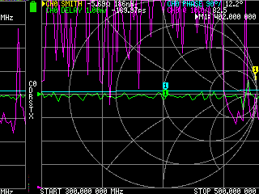
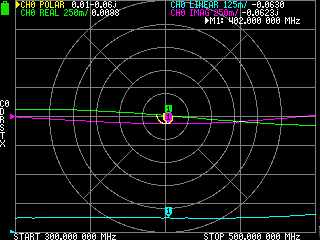
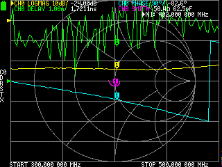
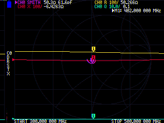

# Measuring the signal chain with NanoVNA

## Attenuators

1. Set the stimulus to 300MHz - 500MHz
2. Calibrate the VNA correctly with SOLT calibration kit
3. Connect the Device Under Test (DUT) and terminate it with short
4. Run `python nanovna-02-attenuators.py`

## Faulty results

## Too much manual work

