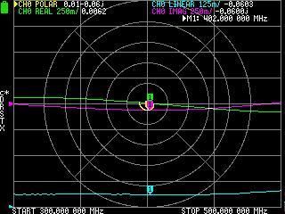
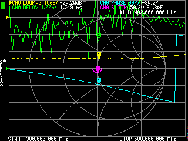
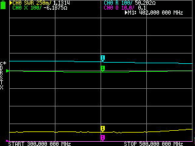

# Testing the refactored serial implementation
Idea is to just dump all different versions of screens, to quickly get the idea where the different measurements are at.
The screens are from different scans, as the device needs to be resumed to normal operation in order to refresh the 
screen.

